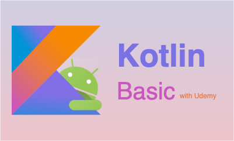

# Docs

  

    <a href="/docs/series/flutter-tdd" class="no-underline">
        

            
        

        

            <h3 class="mt-2 text-lg leading-6 font-medium text-black">Flutter TDD</h3>
            Flutter
            Android
            Ios
        

    </a>
  

  

    <a href="/docs/series/swift-basic" class="no-underline">
        

            
        

        

            <h3 class="mt-2 text-lg leading-6 font-medium text-black">Swift Basic</h3>
            Ios
            Swift
        

    </a>
  

  

    <a href="/docs/series/kotlin-basic" class="no-underline">
        

            
        

        

            <h3 class="mt-2 text-lg leading-6 font-medium text-black">Kotlin Basic</h3>
            Android
            Kotlin
            Language
        

    </a>
  

  

    <a href="/docs/series/jetpack-compose" class="no-underline">
        

            
        

        

            <h3 class="mt-2 text-lg leading-6 font-medium text-black">Android with Jetpack Compose</h3>
            Android
            Kotlin
        

    </a>
  

  

    <a href="/docs/series/spring-sts3" class="no-underline">
        

            
        

        

            <h3 class="mt-2 text-lg leading-6 font-medium text-black">Spring with STS3</h3>
            Spring
            Java
        

    </a>
  

  

    <a href="/docs/series/java-programming-skill" class="no-underline">
        

            
        

        

            <h3 class="mt-2 text-lg leading-6 font-medium text-black">Java Programming Skill</h3>
            Java
        

    </a>
  

----